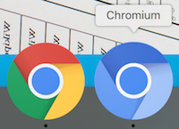

# Old Hangouts Chrome extension

## Description
Revert back to the old hangouts extension (with floating window chat)  

## Important update
The [Chrome team has confirmed](https://bugs.chromium.org/p/chromium/issues/detail?id=467808) that starting from Chrome version 54 and above panels will not be supported.
Panels support is the feature in charge of docking floating windows in hangouts

**Solution:** Follow instructions to **[Install Chromium version 52.0.2743.0](https://github.com/old-hangouts/Chromium-52.0.2743.0)** so Chromium (older open source version of Chrome that supports panels) and Chrome (with most recent updates) can be running at the same time. We highly advice not to stop updating your Chrome browser

## Installation (see screenshots below)
* Make sure you have installed [Chromium version 52.0.2743.0](https://github.com/old-hangouts/Chromium-52.0.2743.0)
* Download this repository (or clone it)
* Open Chromium and go to chrome://extensions
* Make sure "Developer Mode" is checked
* Click "Load Unpacked Extension..."
* Find the unzipped/cloned directory
* Make sure you disable the official extension

## Notice
* Dismiss the disable update Hangouts alert (included in the floating list of contacts)
* Don't disable developer mode extensions (you might see some alerts from Chromium)
* Don't move or delete the folder you added in Chromium (otherwise you will have to redo the installation steps)
* Keep using and updating Chrome as normal (except for the old hangouts extension).
* Don't use Chromium for anything besides hangouts.

## Installation - step by step
### Step 1
* Download this repository (or clone it)
* Open Chromium and go to chrome://extensions
* Make sure "Developer Mode" is checked
* Click "Load Unpacked Extension..."  

### Step 2
* Find the unzipped/cloned directory  

### Step 3
* Make sure you disable the official extension in Chrome 

## Authors
* Patricia MAYO TEJEDOR & Sandoche ADITTANE
* Made from the Google Chrome Extension

## Donations
Feel free to buy us beers :)
https://www.paypal.me/happybots
