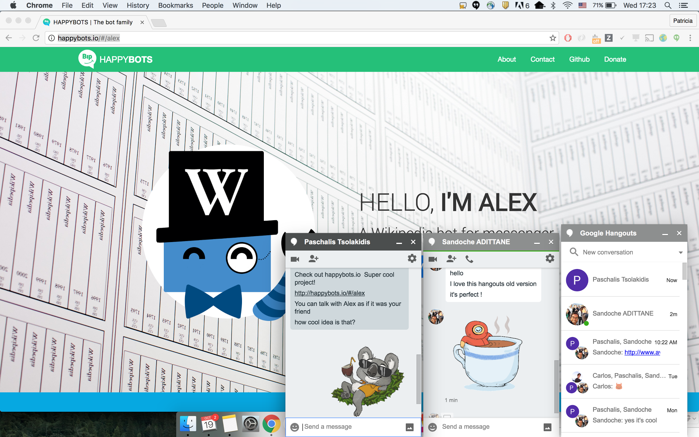
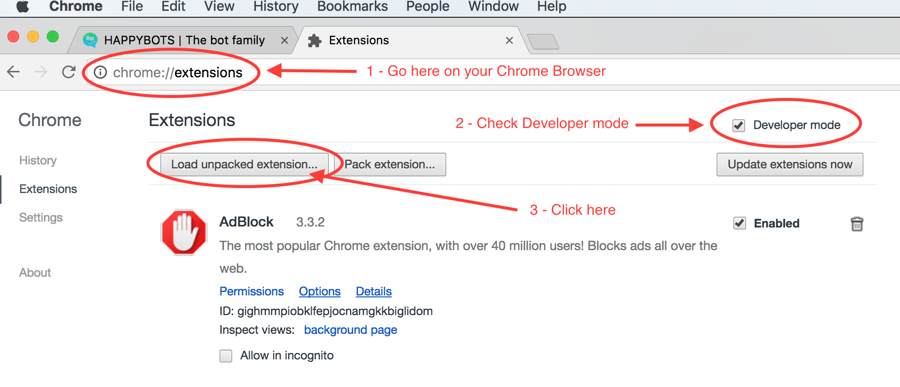
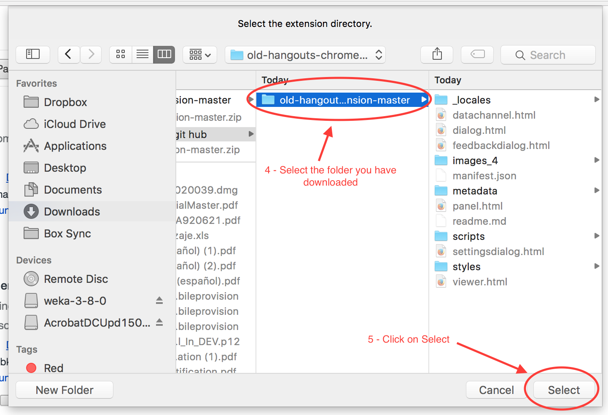
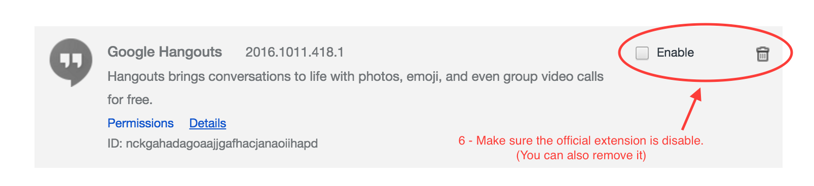

# Old Hangouts Chrome extension

## Description
Revert back to the old hangouts extension (with floating window chat)  

## Installation (see screenshots below)
* Download this repository (or clone it)
* Open Chrome and go to chrome://extensions
* Make sure "Developer Mode" is checked
* Click "Load Unpacked Extension..."
* Find the unzipped/cloned directory
* Make sure you disable the official extension

## Notice you might get two alerts
* Dismiss the disable update Hangouts alert
* Don't disable developer mode extensions

## Installation - step by step
### Step 1
* Download this repository (or clone it)
* Open Chrome and go to chrome://extensions
* Make sure "Developer Mode" is checked
* Click "Load Unpacked Extension..."  

### Step 2
* Find the unzipped/cloned directory  

### Step 3
* Make sure you disable the official extension  

## Authors
* Patricia MAYO TEJEDOR & Sandoche ADITTANE
* Made from the Google Chrome Extension

## Donations
Feel free to buy us beers :)
https://www.paypal.me/happybots
